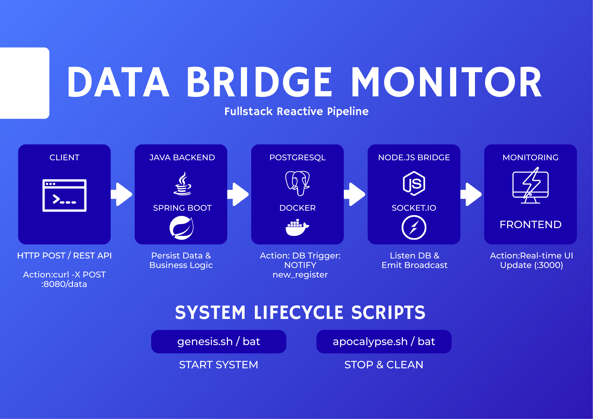

# data-bridge-monitor

*Prerequisites: > - Docker & Docker Compose installed.*

[ WEB MONITORING ] <--(Socket.io)-- [ NODE BRIDGE ] <--(Notify)-- [ POSTGRES ] (Browser :3000) (Port 3000) (Port 5432)

flux novo : [CLIENTE] → POST :8080/data → [JAVA] → [POSTGRES] → [NODE] → [WEB HTML] real-time : socket.io connection established on client load web view : open index.html in browser to see live updates

scripts linux/fedora : ./genesis.sh (up docker, build java, start node) ./apocalypse.sh (stop all, clean containers, kill ports)

send data : curl -X POST http://localhost:8080/data -H "Content-Type: application/json" -d '{"content": "socket test"}' logs node : check terminal for "data received from postgres and emitted to socket"

